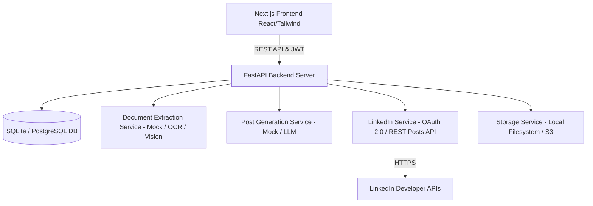

# Architecture Overview - Achievement2LinkedIn

## System Components

1. **Frontend (Next.js 14 App Router)**
   - Landing page with SaaS design system (Glassmorphism, animations, modern typography).
   - Authentication pages (Login, Register, Logout).
   - Dashboard with stats, recent posts, connection status, creation launcher.
   - 4-Step Achievement Workflow:
     1. Document Upload & File Validation.
     2. OCR Result Verification & Classification.
     3. AI Post Generation, Multi-variation Selection & Tone Tweaker.
     4. Realistic LinkedIn Preview & Explicit "Approve & Publish" Modal.

2. **Backend (FastAPI & SQLAlchemy)**
   - Security layer: Passlib (bcrypt), PyJWT, Fernet encryption for OAuth tokens.
   - Core Services:
     - `AuthService`: Authentication, JWT access/refresh logic.
     - `AchievementService`: Document storage, job state management.
     - `DocumentExtractionService`: Modular OCR/AI parser.
     - `PostGenerationService`: Modular LLM prompt & post builder.
     - `LinkedInService`: OAuth 2.0 flow, OpenID Connect userinfo, binary media upload, and Posts API integration with Mock Mode toggle.

3. **Storage & Data Persistence**
   - User table (ID, Name, Email, Password Hash, Timestamps).
   - LinkedInConnection table (User ID, Encrypted Access Token, Expiry, Member ID, Scopes).
   - Achievement table (Original file URL, File type, Extracted JSON, Verified JSON, Status state machine).
   - Post table (Caption, Hashtags, Tone, LinkedIn Post ID/URL, Status, Error log).
